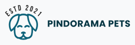

# Pindorama Pets

Pindorama Pets é um site modelo para petshops que foi desenvolvido como projeto durante o período de trainee da UNECT Jr.

# Objetivo

Este site foi criado como parte de um processo avaliativo para demonstrar habilidades em desenvolvimento front-end utilizando tecnologias web padrão (HTML, CSS e JavaScript), com foco em design responsivo e boas práticas de codificação.

## Stack utilizada

**Front-end:** HTML5, CSS3, JavaScript 

**Back-end:** JavaScript

## Autores

- [@JoseRenatoCardoso](https://github.com/JoseRenatoCardoso)
- [@yasSayuri](https://github.com/yasSayuri)